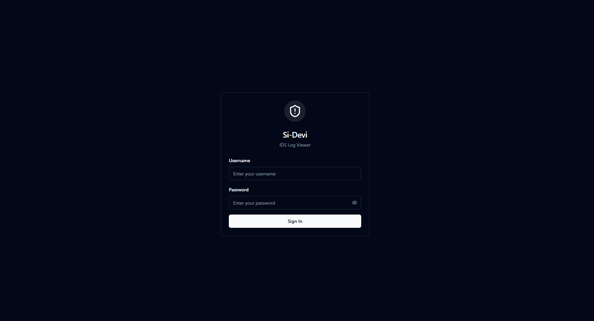
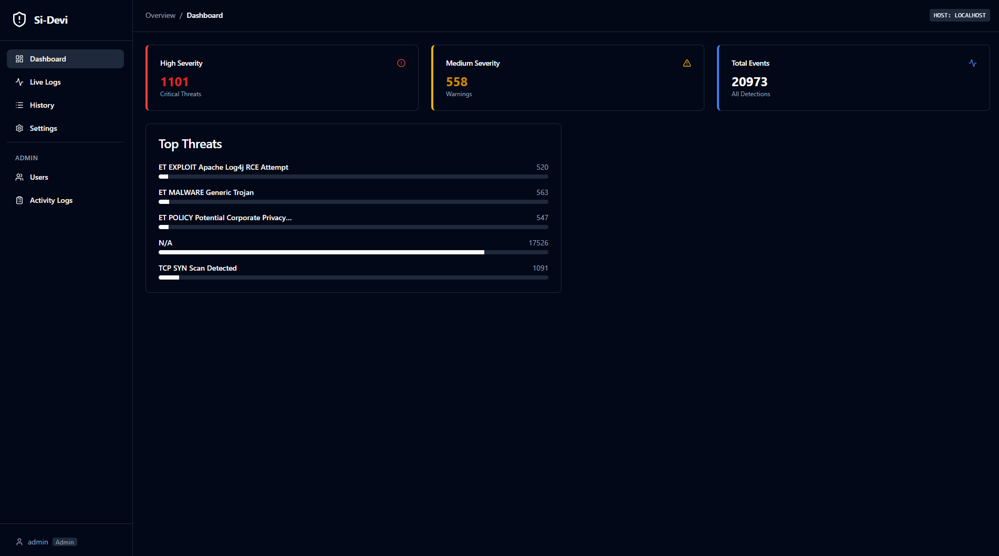
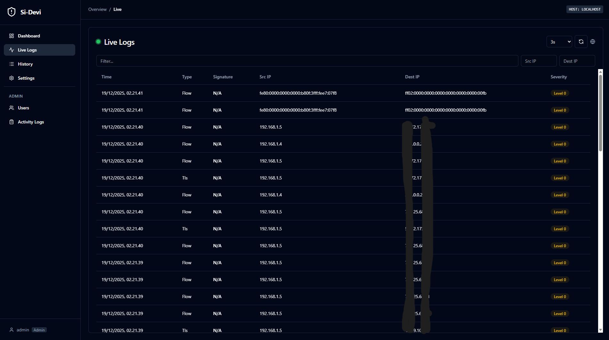
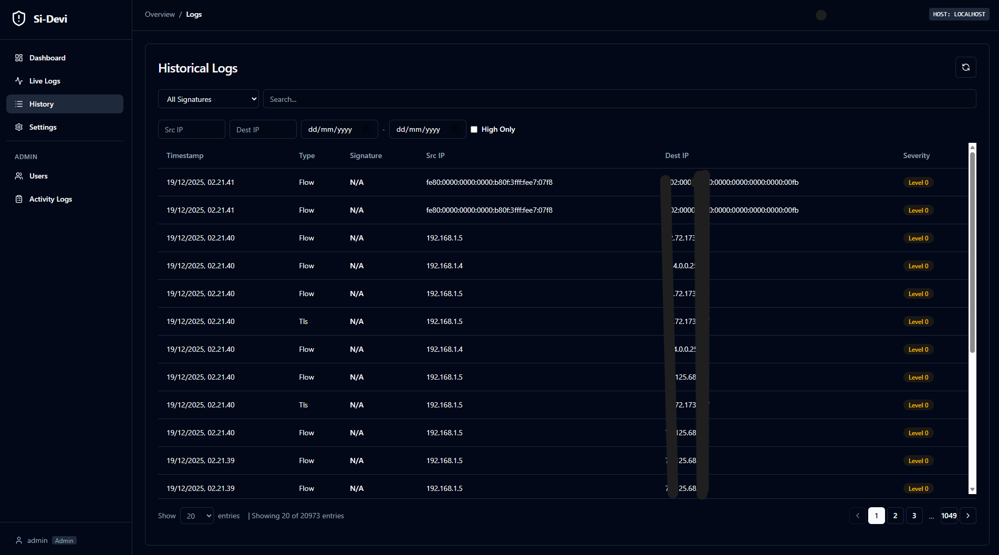
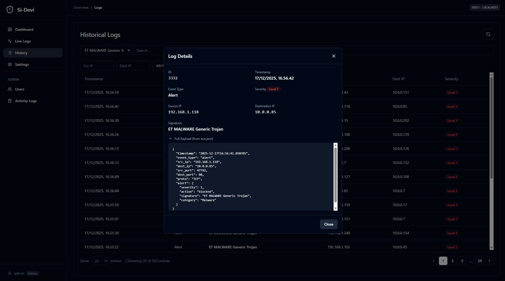
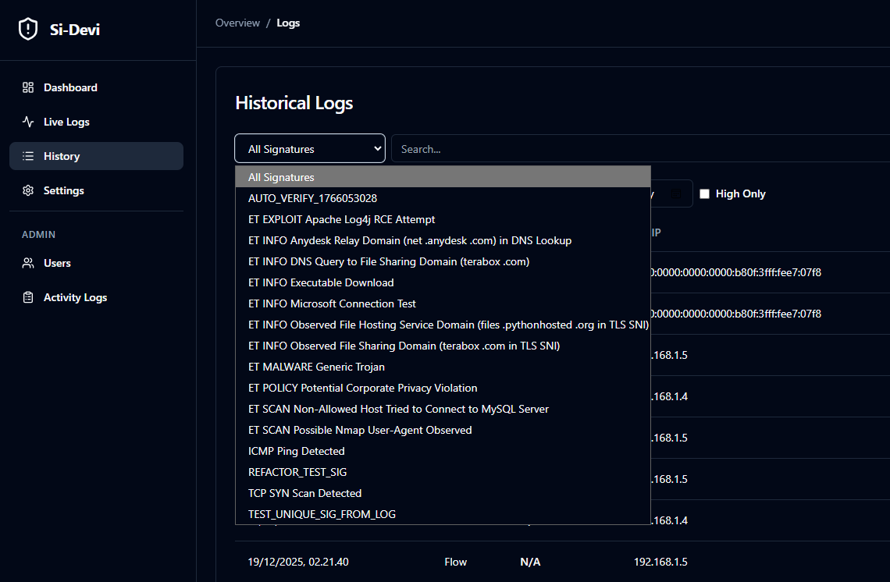
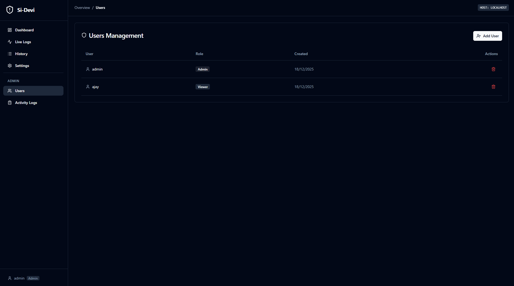
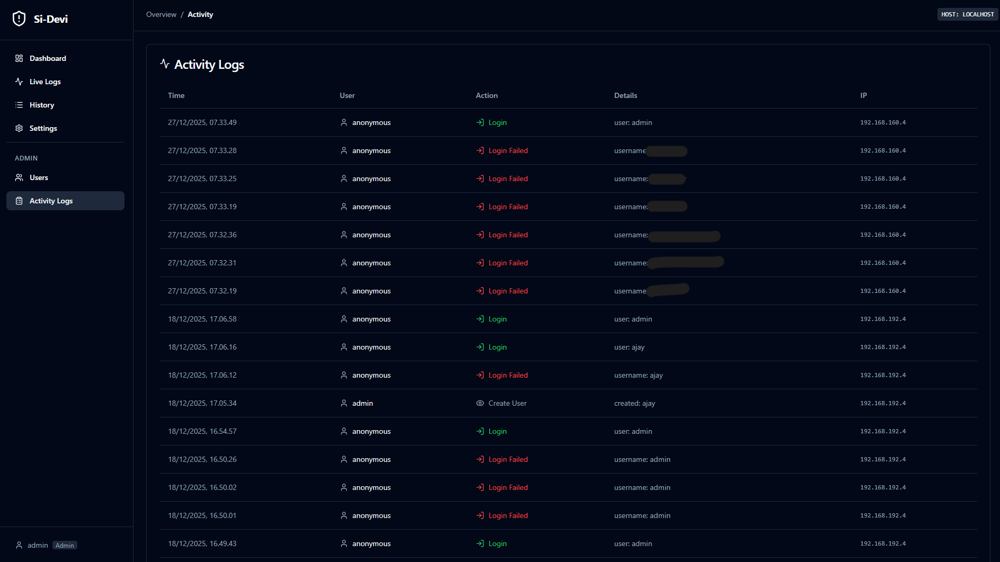
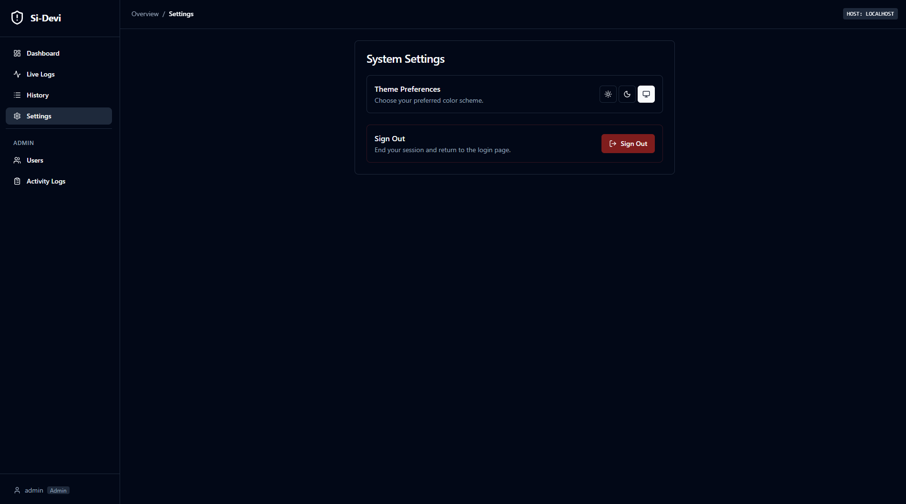

# Si-Devi - Sistem Informasi Deteksi dan View Intrusi

<p align="center">
  
  
  
  
</p>

> ⚠️ **Disclaimer**
> 
> This project is developed for **research and educational purposes only**. It has not been tested for production environments. If you intend to use this in production, please conduct thorough testing and security audits first.

A modern, dark-themed web interface for visualizing and managing **Suricata IDS** logs. This application helps security analysts and network administrators to easily monitor, search, and analyze intrusion detection alerts in real-time.

## ✨ Features

- 📊 **Real-time Dashboard** - Live statistics and alert monitoring
- 🔍 **Advanced Search** - Filter logs by IP, signature, severity, and date range
- 📋 **Log History** - Paginated view of all historical alerts
- 🔐 **User Authentication** - Secure JWT-based login with admin/viewer roles
- 📈 **Activity Logging** - Track user actions for audit purposes
- 🐳 **Dockerized** - Easy deployment with Docker Compose

## 📸 Screenshots

### Login Page


### Dashboard


### Live Logs


### History Logs


### Log Detail


### Signature Filters


### User Management (Admin)


### User Activity Logs (Admin)


### Settings


## 🏗️ Architecture

```
┌─────────────────────────────────────────────────────────────┐
│                        Host Machine                          │
│  ┌─────────────┐                                             │
│  │  Suricata   │ ──writes──▶ ./logs/eve.json                │
│  │ (Native)    │                                             │
│  └─────────────┘                     │                       │
│                                      ▼                       │
│  ┌─────────────────── Docker Compose ─────────────────────┐  │
│  │                                                         │  │
│  │  ┌──────────┐    ┌──────────┐    ┌──────────┐          │  │
│  │  │ Frontend │◀──▶│ Backend  │◀──▶│  MySQL   │          │  │
│  │  │ (Nginx)  │    │ (Flask)  │    │   DB     │          │  │
│  │  │ :80      │    │ :5000    │    │ :3308    │          │  │
│  │  └──────────┘    └──────────┘    └──────────┘          │  │
│  │                       ▲                                 │  │
│  │                       │ reads                           │  │
│  │                  ./logs/eve.json                        │  │
│  └─────────────────────────────────────────────────────────┘  │
└─────────────────────────────────────────────────────────────┘
```

## 🚀 Quick Start

### Prerequisites
- **Docker & Docker Compose** - [Install Docker](https://docs.docker.com/get-docker/)
- **Suricata** - Installed natively on host machine ([Download](https://suricata.io/download/))

### 1. Clone Repository
```bash
git clone https://github.com/yourusername/IDSLogViewer.git
cd IDSLogViewer
```

### 2. Configure Environment
```bash
# Copy example environment file
cp .env.example .env

# Edit .env and set your secure values:
# - MYSQL_ROOT_PASSWORD
# - MYSQL_PASSWORD / DB_PASS
# - JWT_SECRET (generate with: python -c "import secrets; print(secrets.token_hex(32))")
# - ADMIN_PASSWORD
```

### 3. Start Application
```bash
docker-compose up -d
```

### 4. Access Web Interface
Open browser: **http://localhost**

**Default Login Credentials:**
| Username | Password | Role |
|----------|----------|------|
| `admin` | `admin123` | Admin |

> ⚠️ **Security Warning:** Change the default password immediately after first login! You can set custom credentials in your `.env` file using `ADMIN_USERNAME` and `ADMIN_PASSWORD` before first startup.

## 🛡️ Suricata Setup (Windows)

Suricata runs **natively on Windows** to capture network traffic. The logs are then read by the Docker containers.

### 1. Install Suricata
Download and install [Suricata for Windows (MSI)](https://suricata.io/download/)

### 2. Find Network Interface
```powershell
& "C:\Program Files\Suricata\suricata.exe" --list-devname
```
Find your Wi-Fi/Ethernet GUID (e.g., `\Device\NPF_{...}`)

### 3. Configure Log Output
Edit `C:\Program Files\Suricata\suricata.yaml`:
- Set `default-log-dir` to your project's `logs` folder:
  ```yaml
  default-log-dir: C:\path\to\IDSLogViewer\logs
  ```

### 4. Run Suricata
```powershell
# Auto-detect Wi-Fi interface and run
$dev = Get-NetAdapter -Name "Wi-Fi" | Select-Object -ExpandProperty DeviceID
& "C:\Program Files\Suricata\suricata.exe" `
    -c "C:\Program Files\Suricata\suricata.yaml" `
    -i "\Device\NPF_$dev" `
    -k none
```

> **Note:** The `-k none` flag ignores checksum errors common on Windows.

### 5. Verify Logs
```powershell
Get-Content -Path "logs/eve.json" -Wait -Tail 10
```

## 📁 Project Structure

```
IDSLogViewer/
├── backend/                 # Flask API server
│   ├── app.py              # Main application
│   ├── auth.py             # JWT authentication
│   ├── log_parser.py       # Suricata log parser
│   ├── requirements.txt    # Python dependencies
│   └── Dockerfile
├── frontend/               # Vue.js SPA
│   ├── src/
│   │   ├── components/     # UI components
│   │   └── views/          # Page views
│   ├── package.json
│   └── Dockerfile
├── logs/                   # Suricata output (gitignored)
├── database/               # MySQL data (gitignored)
├── docker-compose.yml      # Container orchestration
├── .env.example            # Environment template
└── README.md
```

## 🔮 Roadmap

Future development plans include:

- [ ] **Suricata Management** - Configure Suricata rules from web interface
- [ ] **Rule Editor** - Create and edit detection rules
- [ ] **Alert Notifications** - Email/Webhook alerts for high-severity events
- [ ] **Report Generation** - Export PDF/CSV reports
- [ ] **Multi-tenant Support** - Multiple IDS sensor management
- [ ] **Dashboard Widgets** - Customizable dashboard layouts

## 🔧 Development

### Running Locally (without Docker)

**Backend:**
```bash
cd backend
python -m venv venv
source venv/bin/activate  # or .\venv\Scripts\activate on Windows
pip install -r requirements.txt
python app.py
```

**Frontend:**
```bash
cd frontend
npm install
npm run dev
```

## 📄 License

This project is open source and available under the [MIT License](LICENSE).

## 🤝 Contributing

Contributions are welcome! Please feel free to submit a Pull Request.

---

<p align="center">
  Made with ❤️ for Network Security
</p>